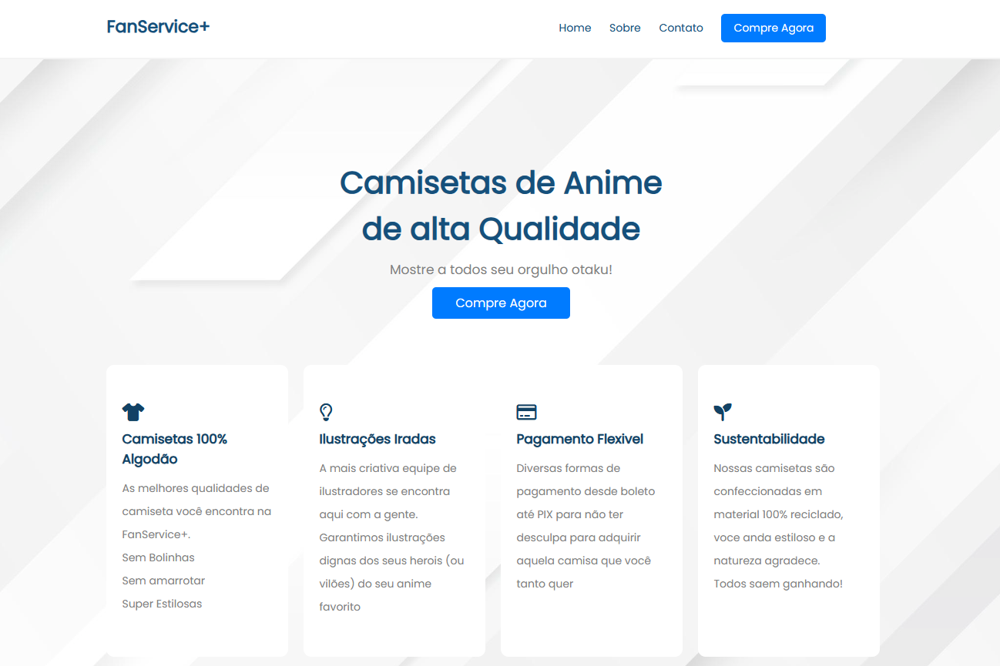

# 🧢 Fanservice-Tshirts

### Loja virtual de camisetas para otakus e fãs de anime — [Acesse aqui](https://fanservice-tshirts.vercel.app/)

## ✨ Sobre o Projeto

**Fanservice-Tshirts** é um projeto de e-commerce fictício voltado ao público otaku, desenvolvido como parte da minha formação em front-end. O objetivo principal foi criar uma loja virtual responsiva e visualmente atrativa, aplicando na prática os conhecimentos de HTML e CSS com foco em UX/UI.

A ideia foi unir minha paixão por animes com o desenvolvimento web, criando um ambiente temático onde usuários podem explorar uma coleção fictícia de camisetas inspiradas em personagens e universos icônicos.

---

## 🎯 Objetivos

- Desenvolver uma loja virtual temática desde o zero  
- Praticar estruturação semântica com HTML5  
- Criar um layout responsivo e agradável com CSS3  
- Aplicar conceitos de design voltados à experiência do usuário  

---

## 🛠️ Tecnologias Utilizadas

- **HTML5:** Estrutura semântica e bem organizada das páginas  
- **CSS3:** Estilização completa com foco em responsividade e visual  
- **Vercel:** Hospedagem gratuita e simples para projetos front-end  

---

## 🌐 Acesse o Projeto

🔗 [https://fanservice-tshirts.vercel.app](https://fanservice-tshirts.vercel.app)

---

## 🧠 Aprendizados

Este projeto me permitiu consolidar habilidades fundamentais no front-end, como:

- Criação de layouts com CSS Grid e Flexbox  
- Estruturação limpa e organizada com HTML semântico  
- Noções práticas de responsividade e design visual  

---

## 🤝 Contribuições

Quer contribuir com o projeto? Sinta-se à vontade para fazer um fork e enviar melhorias — principalmente se quiser implementar novas funcionalidades como busca, filtros ou até um back-end futuramente!

---

## 📬 Contato

Vamos trocar uma ideia? Estou sempre aberto a feedbacks e conexões:

- 💼 [LinkedIn](https://www.linkedin.com/in/lucca-ozorio-nascimento-971244133/)  
- 💻 [GitHub](https://github.com/LuccaWolfric)  
- 📸 [Instagram](https://www.instagram.com/lucca.ozorio/)

---

## 💬 Agradecimento

Agradeço por visitar o projeto! Espero que ele sirva como inspiração e referência para quem também está começando na área de desenvolvimento web. 🌟
